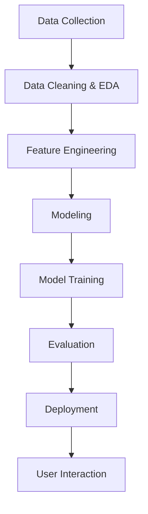

# STKI-A11.2022.14610-UAS

# Project Prediksi Harga Mobil

## 1. Judul / Topik Project dan Identitas Lengkap
**Topik**: Prediksi Harga Mobil Bekas  
- **Nama**: Bimo Cahyo Widyanto
- **Nim**: A11.2022.14610
- **Matkul**: Data Mining A11.4517

---

## 2. Ringkasan dan Permasalahan Project
### Ringkasan:
Proyek ini bertujuan untuk memprediksi harga mobil bekas berdasarkan merek, model, tahun model, dan jarak tempuh. Aplikasi ini memungkinkan pengguna untuk mendapatkan estimasi harga mobil secara cepat dan akurat melalui antarmuka Streamlit.

### Permasalahan:
Penentuan harga mobil bekas sering kali subjektif dan tidak konsisten, sehingga mempersulit pembeli dan penjual dalam mengambil keputusan.

### Tujuan:
1. Mengembangkan model prediksi harga mobil bekas.
2. Memberikan estimasi harga berdasarkan data historis.
3. Mempermudah pengguna dalam memahami nilai kendaraan mereka.

### Model / Alur Penyelesaian:
Alur pengerjaan proyek ini divisualisasikan dalam bagan berikut:




## 3. Penjelasan Dataset, EDA dan Proses Features Dataset
### Penjelasan Dataset:
Dataset yang digunakan adalah "used_cars.csv" yang berisi informasi berikut:
- **brand**: Merek mobil
- **model**: Model mobil
- **model_year**: Tahun produksi
- **milage**: Jarak tempuh dalam mil
- **fuel_type**: Jenis bahan bakar
- **price**: Harga kendaraan (target)

### Proses EDA:
1. Membersihkan data dengan menghapus tanda baca pada kolom "milage" dan "price".
2. Mengatasi nilai kosong pada kolom utama seperti "brand" dan "price".
3. Melakukan eksplorasi statistik untuk memahami distribusi harga dan pengaruh fitur terhadap harga.

### Proses Features Dataset:
Fitur yang digunakan:
- Kategori: **brand**, **model**
- Numerik: **model_year**, **milage**
Target: **price** (dalam USD).

---

## 4. Proses Learning / Modeling
### Alur Modeling:
1. Preprocessing data menggunakan `OneHotEncoder` untuk fitur kategori.
2. Menggunakan pipeline model berbasis `RandomForestRegressor` untuk regresi harga.
3. Membagi data menjadi training dan testing dengan perbandingan 80:20.

### Tools yang Digunakan:
- **Scikit-learn** untuk preprocessing dan modeling.
- **Streamlit** untuk deployment aplikasi.
- **Pandas** untuk manipulasi data.

---

## 5. Performa Model
### Evaluasi Model:
- **Mean Absolute Error (MAE)**: $19,919.76.
- **Akurasi Model**: Model memberikan estimasi yang cukup baik untuk memprediksi harga kendaraan dengan mempertimbangkan kompleksitas dataset.

---

## 6. Diskusi Hasil dan Kesimpulan
### Diskusi:
Model menunjukkan performa yang cukup baik dalam memprediksi harga mobil bekas. Namun, terdapat beberapa aspek yang mempengaruhi keakuratan prediksi, seperti keterbatasan fitur (misalnya: riwayat kecelakaan tidak digunakan).

### Kesimpulan:
- Model berhasil memberikan estimasi harga berdasarkan input pengguna.
- Pengguna dapat dengan mudah mendapatkan prediksi harga melalui antarmuka Streamlit.
- Diperlukan dataset yang lebih lengkap untuk meningkatkan performa model.

---

## Panduan Penggunaan
1. Jalankan aplikasi menggunakan perintah berikut:
   ```bash
   streamlit run app.py
   ```
2. Masukkan input seperti **brand**, **model**, **model year**, dan **milage**.
3. Klik tombol "Predict Price" untuk melihat estimasi harga.

